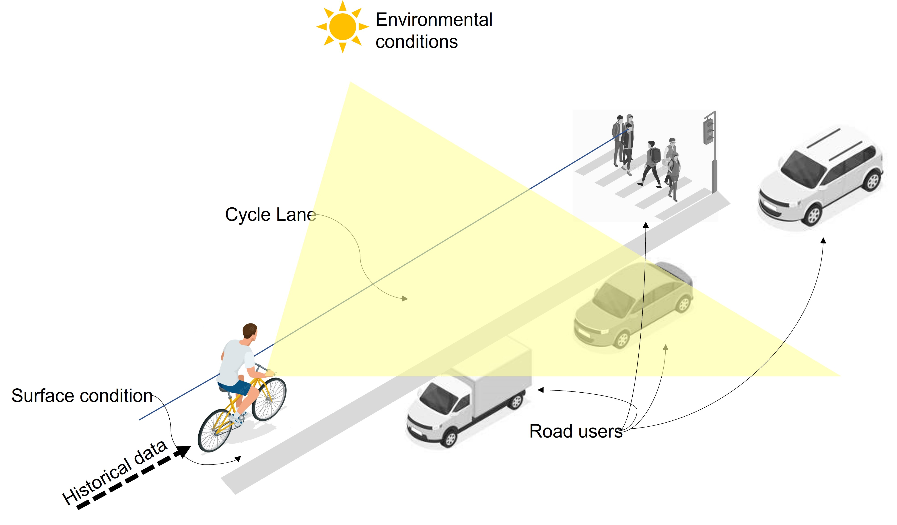

# CyclingNearMisses (GrangerCausality)

## A computer vision and granger causality framework for analysing cycling near misses from naturalistic cycling video streams

This is the official implementation of GrangerNearMisses




Install requirements:
```python
pip install -r requirements.txt
```
Download dataset:

Link to appear here.

Key hyperparameters for using ImageSig with image array:
```python
Code to be available soon.
```

